# Exemple de soumission d'activité
ÉTS - LOG430 - Architecture logicielle - Été 2026

Étudiant(e) : Chris-Emmanuel Berton

# Questions
(Il est obligatoire d'ajouter du code, des captures d'écran ou des sorties de terminal pour illustrer chacune de vos réponses.)

##  Question 1 : Dans la RFC 7231, nous trouvons que certaines méthodes HTTP sont considérées comme sûres (safe) ou idempotentes, en fonction de leur capacité à modifier (ou non) l'état de l'application. Lisez les sections 4.2.1 et 4.2.2 de la RFC 7231 et répondez : parmi les méthodes mentionnées dans l'activité 2, lesquelles sont sûres, non sûres, idempotentes et/ou non idempotentes?
Safe -> read only. Exemples :  GET, HEAD, OPTIONS, and TRACE
Unsafe -> write. Modifie base données. PATCH, CONNECT, POST PUT, DELETE

Idempotentes : Exemple : PUT, DELETE, GET,
Non-Idempotent :  POST, PATCH and CONNECT.

Les méthodes du test_stock_flow() considérés non sûres et non idempotents sont Post,
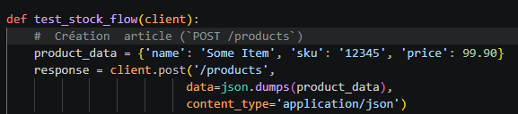

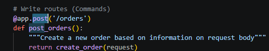
alors que les méthodes sûres sont Get.

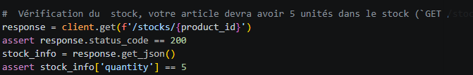

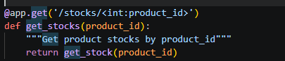

Finalement, les méthodes Delete et Get sont idempotentes. 

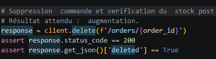

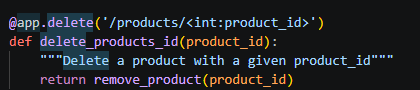

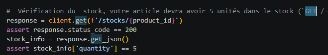
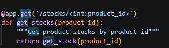


## 2. Question 2 : Décrivez l'utilisation de la méthode join dans ce cas. Utilisez les méthodes telles que décrites à Simple Relationship Joins et Joins to a Target with an ON Clause dans la documentation SQLAlchemy pour ajouter les colonnes demandées dans cette activité. Veuillez inclure le code pour illustrer votre réponse.

La méthode join crée un tableau qui regroupe les informations du stock d'un produit (défini par son id) aux autres informations du produit présents dans la table Product en recherchant les informations associées à l'id du stock mentionné.

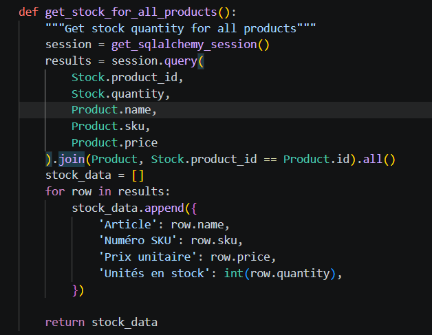

## 3. Question 3 : Quels résultats avez-vous obtenus en utilisant l’endpoint POST /stocks/graphql-query avec la requête suggérée ? Veuillez joindre la sortie de votre requête dans Postman afin d’illustrer votre réponse.

L'endpoint POST /stocks/graphql-query affiche les données associées aux colonnes spécifiées.

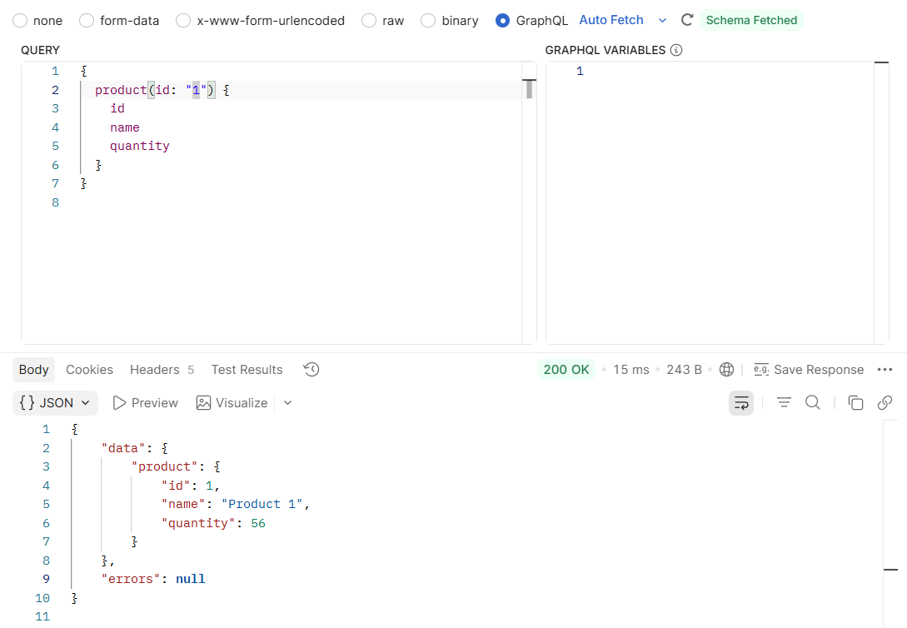

## 4. Question 4 : Quelles lignes avez-vous changé dans update_stock_redis? Veuillez joindre du code afin d’illustrer votre réponse.

Les lignes modifiées reflètent les ajouts de colonnes dans la structure de données.
De plus, le mapping a été réajusté pour refléter le changement.
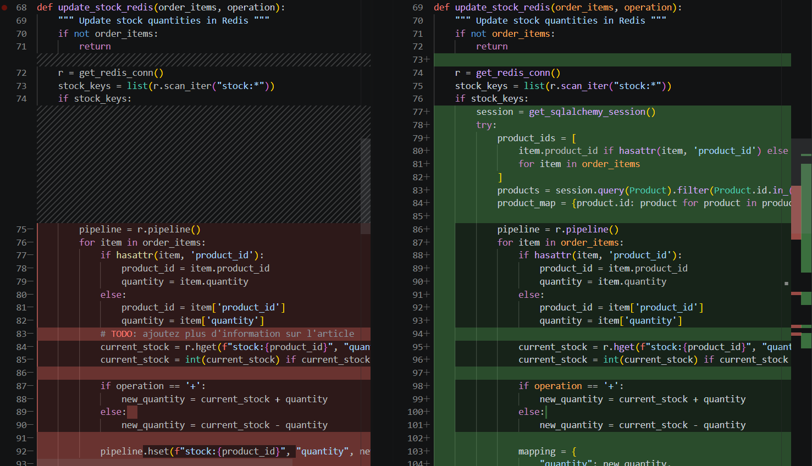

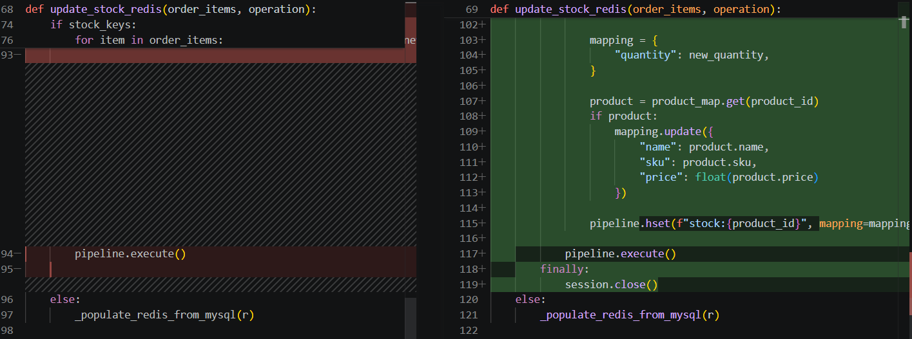


## 5. Question 5 : Quels résultats avez-vous obtenus en utilisant l’endpoint POST /stocks/graphql-query avec les améliorations ? Veuillez joindre la sortie de votre requête dans Postman afin d’illustrer votre réponse.

Quoique POST n'admet pas d'erreurs avec les ajouts, le GraphQl Query ne considère pas être capable de lire, mais répond à la requête adéquatement.
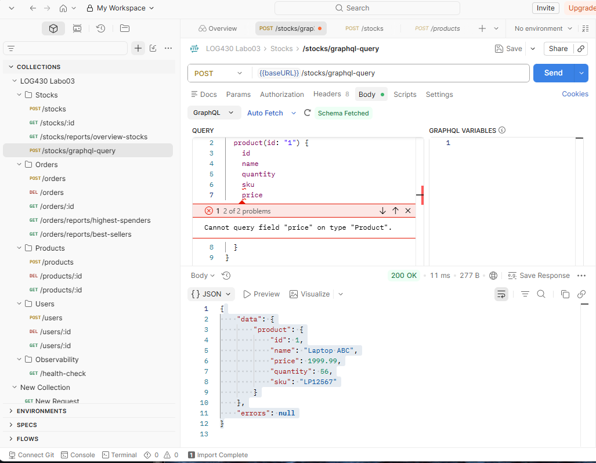

En plus, la structure incluant les nouveaux paramètres existe dans le Product.

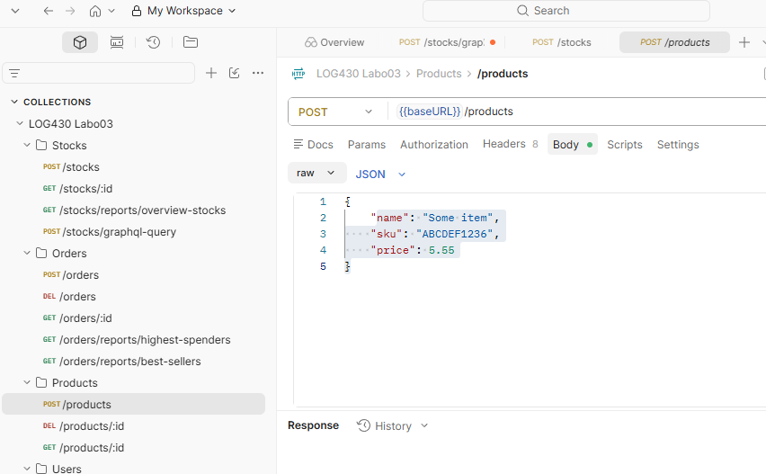


## 6.  Question 6 : Examinez attentivement le fichier docker-compose.yml du répertoire scripts, ainsi que celui situé à la racine du projet. Qu’ont-ils en commun ? Par quel mécanisme ces conteneurs peuvent-ils communiquer entre eux ? Veuillez joindre du code YML afin d’illustrer votre réponse.
Réponse
Le point commun entre les docker-compose est le network. Les deux fichiers spécifient l'utilisation du réseau labo03-network et utilisent le driver : bridge. La communication se fait à travers le réseau labo03-network.

 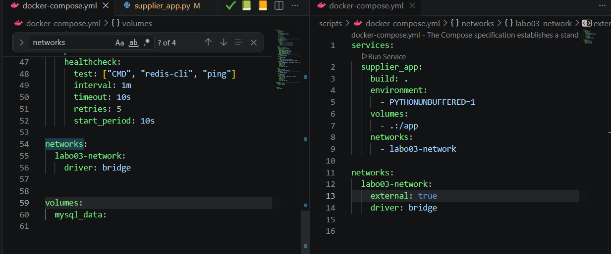

# Déploiement
(Le cas échéant, décrivez votre pipeline CI/CD et ce que vous avez appris dans ce laboratoire en ce qui concerne le déploiement. Il est obligatoire d'ajouter du code, des captures d'écran ou des sorties de terminal pour illustrer votre réponse.)

Ce laboratoire a permis de comprendre la connexion entre 2 services en passant par un réseau commun
et de communiquer avec un front-end
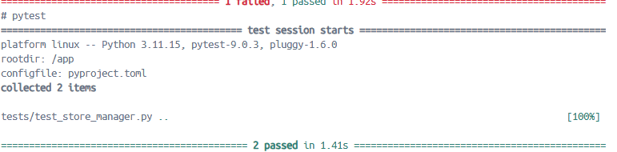

Les configurations de CI/CD sont largement inchangés de la configuration par défaut.

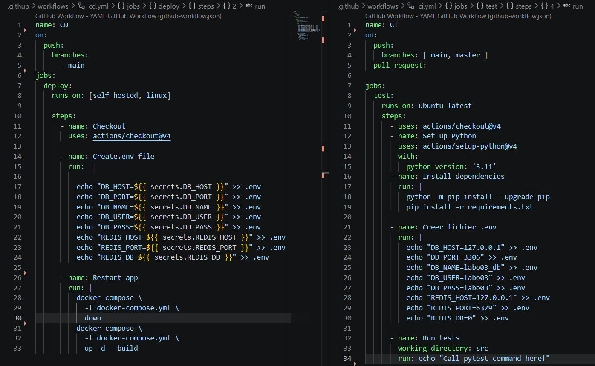

Le changement majeur est la configuration réseau des docker-compose (voir image Question 6).

Au premier lancement de la config présente dans le commit Task 6 : Done. TODO : extra, la communication entre supplier_app.py et store_manager fonctionnait.
```
supplier_app-1 | 2026-06-04 22:34:02,396 - ERROR - Connection error on attempt 1 supplier_app-1 | 2026-06-04 22:34:04,397 - INFO 
- Calling http://store_manager:5000/stocks/graphql-query (attempt 2/3) supplier_app-1 | 2026-06-04 22:34:08,416 - INFO - Response: 200 - OK 
supplier_app-1 | 2026-06-04 22:34:08,416 - INFO - Response body: {"data":{"product":{"id":1,"name":"Laptop ABC","quantity":56}},"errors":null} supplier_app-1 | ... supplier_app-1 | 2026-06-04 22:34:08,417 
- INFO - Waiting 10 seconds until next call... supplier_app-1 | 2026-06-04 22:34:18,418 
- INFO - --- Call #2 --- supplier_app-1 | 2026-06-04 22:34:18,420 
- INFO - Calling http://store_manager:5000/stocks/graphql-query (attempt 1/3) supplier_app-1 | 2026-06-04 22:34:18,431 
- INFO - Response: 200 - OK supplier_app-1 | 2026-06-04 22:34:18,432 - INFO - Response body: {"data":{"product":{"id":1,"name":"Laptop ABC","quantity":56}},"errors":null} supplier_app-1 | ... supplier_app-1 | 2026-06-04 22:34:18,432 
- INFO - Waiting 10 seconds until next call... supplier_app-1 | 2026-06-04 22:34:28,431 - INFO - --- Call #3 --- supplier_app-1 | 2026-06-04 22:34:28,433 
- INFO - Calling http://store_manager:5000/stocks/graphql-query (attempt 1/3) supplier_app-1 | 2026-06-04 22:34:28,446 
- INFO - Response: 200 - OK supplier_app-1 | 2026-06-04 22:34:28,447 - INFO - Response body: {"data":{"product":{"id":1,"name":"Laptop ABC","quantity":56}},"errors":null} supplier_app-1 | ... supplier_app-1 | 2026-06-04 22:34:28,447 
- INFO - Waiting 10 seconds until next call... supplier_app-1 | 2026-06-04 22:34:38,449 - INFO - --- Call #4 --- supplier_app-1 | 2026-06-04 22:34:38,450 - INFO - Calling http://store_manager:5000/stocks/graphql-query (attempt 1/3) supplier_app-1 | 2026-06-04 22:34:38,458 
- INFO - Response: 200 - OK supplier_app-1 | 2026-06-04 22:34:38,459 - INFO - Response body: {"data":{"product":{"id":1,"name":"Laptop ABC","quantity":56}},"errors":null} supplier_app-1 | ... supplier_app-1 | 2026-06-04 22:34:38,459 
- INFO - Waiting 10 seconds until next call... supplier_app-1 | 2026-06-04 22:34:48,460 
- INFO - --- Call #5 --- supplier_app-1 | 2026-06-04 22:34:48,461 
- INFO - Calling http://store_manager:5000/stocks/graphql-query (attempt 1/3) supplier_app-1 | 2026-06-04 22:34:48,469 
- INFO - Response: 200 - OK supplier_app-1 | 2026-06-04 22:34:48,470 - INFO - Response body: {"data":{"product":{"id":1,"name":"Laptop ABC","quantity":56}},"errors":null} supplier_app-1 | ... supplier_app-1 | 2026-06-04 22:34:48,472 
- INFO - Waiting 10 seconds until next call... supplier_app-1 | 2026-06-04 22:34:58,472 
- INFO - --- Call #6 --- supplier_app-1 | 2026-06-04 22:34:58,473
- INFO - Calling http://store_manager:5000/stocks/graphql-query (attempt 1/3) supplier_app-1 | 2026-06-04 22:34:58,481 
- INFO - Response: 200 - OK supplier_app-1 | 2026-06-04 22:34:58,482 
- INFO - Response body: {"data":{"product":{"id":1,"name":"Laptop ABC","quantity":56}},"errors":null}
```
Cependant, les builds subséquents de cette même config échouaient.

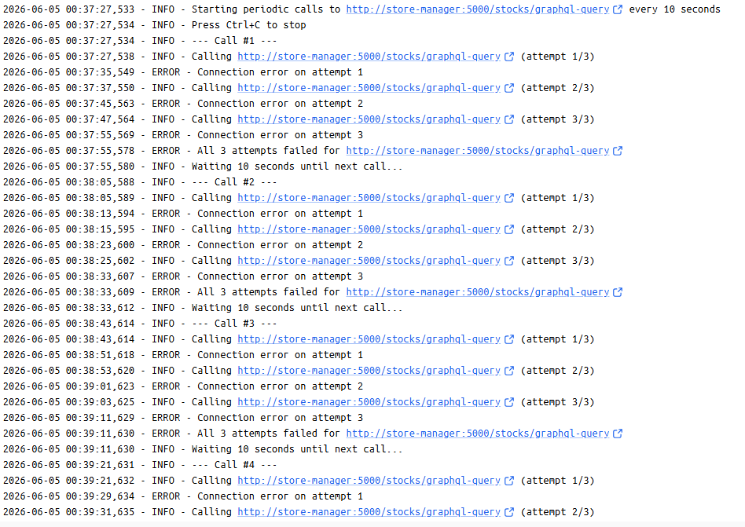
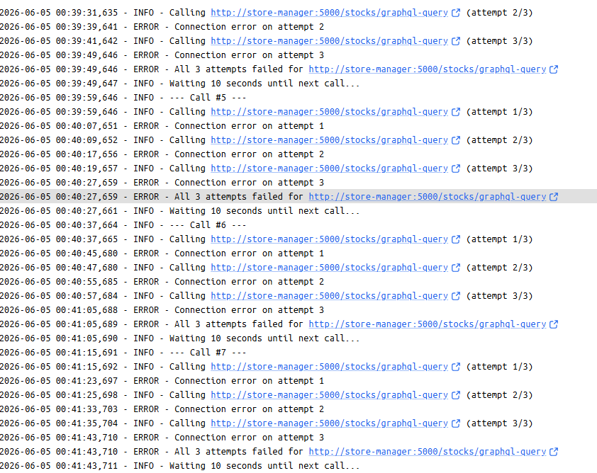